# ME499 Spring 2022 Project
* Ian Kennedy
* Spring 2022

This repository documents the Northwestern ME499 project that I undertook exploring the implementation of a Koopman Operators based approach to model the odometry of differential drive robots. The robot used for this project was a burger-type turtlebot, though the algorithmic principles applied here could be implemented on any differential-drive wheeled robot. 

## Introduction

Koopman operators can be implemented in robotics active learning scenarios for the identification of a system. A Koopman operator model can then be used in tandem with system inputs to propagate state observations through time. A Koopman model in a mathematical sense models a finite dimensional system in infinite dimensions, though it can be approximated, as is done in this paper, using finite dimensional basis functions that are differentiable. Using a data-driven, least squares approach with pseudoinverse operations, these matrices constructed with these basis functions can be used to construct an approximate Koopman model by observing the system inputs and states over time. 

Sources: I. Abraham and T. D. Murphey, "Active Learning of Dynamics for Data-Driven Control Using Koopman Operators," in IEEE Transactions on Robotics, vol. 35, no. 5, pp. 1071-1083, Oct. 2019, doi: 10.1109/TRO.2019.2923880.
\
Abraham, Ian, Gerardo De La Torre, and Todd D. Murphey. "Model-based control using Koopman operators." arXiv preprint arXiv:1709.01568 (2017).

## Other dependencies

In addition to ROS Noetic and this particular ROS package, several other packages/software repositories are required to run the code present here:
* Gazebo ROS is required to run the cartpole simulations
* The AprilTags repository is required to implement the moving turtlebot modules of the repository. This can be cloned:
\
`git clone https://github.com/AprilRobotics/apriltag_ros.git` 
\
`git clone https://github.com/AprilRobotics/apriltag.git`

* The Realsense camera ROS repository is used for the moving robot modules. This can be installed with instructions from this page: https://github.com/IntelRealSense/realsense-ros#installation-instructions

* Low level control of the turtlebot was accomplished using code developed for a previous course at Northwestern:
`git clone https://github.com/ME495-Navigation/slam-project-ikc8581.git`
\
`git clone https://github.com/ME495-Navigation/nuturtlebot_msgs.git`

To compile the workspace, be sure to run :
`catkin_make_isolated`

## Package contents

The contents of this package are as follows. 

### Supporting Python libraries

There are supporting python library files that were written to abstract the mathematical computation of the Koopman operator from the remainder of the primary ROS node software. They can be found in the src directory.

### Cartpole demos

The early part of the project was spent implementing a Koopman model on a simple system in order to get acquainted with the approach the algorithm uses. The classic cartpole penduluum system was selected, and implemented in both a control balancing context, and a pure system modeling and propagation through time context. Gazebo was used as a simulator. Robot URDF and gazebo files were developed in the urdf folder. In order to run these experiments, the following can be run after cloning this repo into a workspace:

* `roslaunch cartpole cartpole_slide_drive.launch mode:=<mode>`

Mode should be set to "tele" for  system modeling. In order to run the balancing experiment, the pole joint must be set back to a 0 0 0 rpy angle set, and the mode argument should be set to "control"

The remainder of the project was spent implementing the algorithm in the odometry setting on the turtlebot. This part of the project was divided into several parts. 

### Stationary Turtlebot Odometry

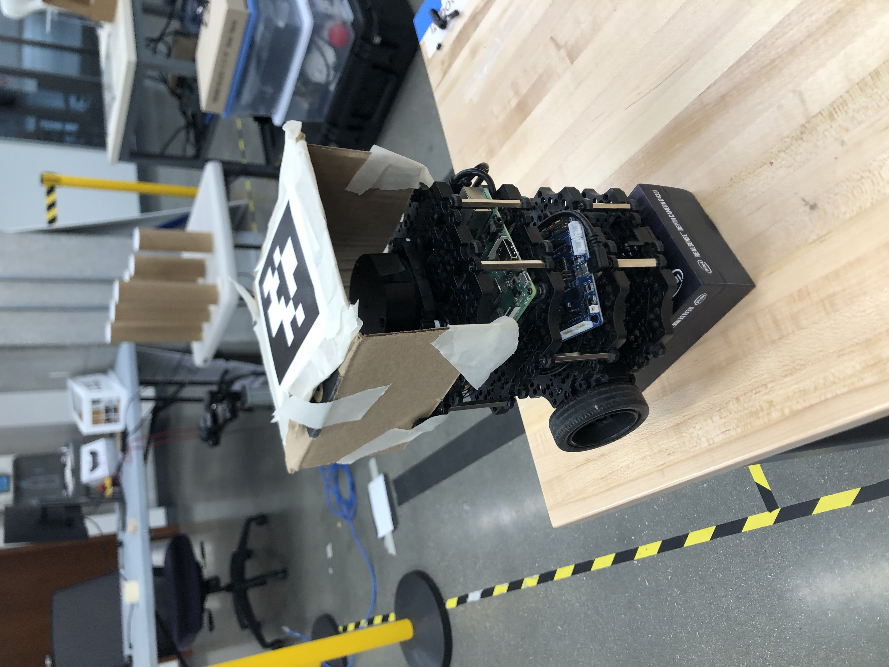

In the first part of the odometry effort, a stationary turtlebot's odometry was computed by elevating the robot's wheels off the ground. In doing so, it was thought that nonlinear dynamics effects such as friction could be eliminated from the system. 
This variant of the algorithm can be run with the following commands.
To launch the turtlebot in a terminal window:
* `nmcli con up eduroam.robot`
* roslaunch nuturtle_control start_robot.launch robot:=name cmd_src:=other

In a separate terminal terminal window:
* `roslaunch cartpole turtle_train.launch mode:=fourier`

Appropriate training times range in the 20s - 30s range.

The scripts folder contains postprocessing scripts used in the plotting of koopman system observable states.

### Moving Turtlebot Odometry

A sample snapshot of the testing setup, with the camera overhead, can be seen in the screenshot below:
\
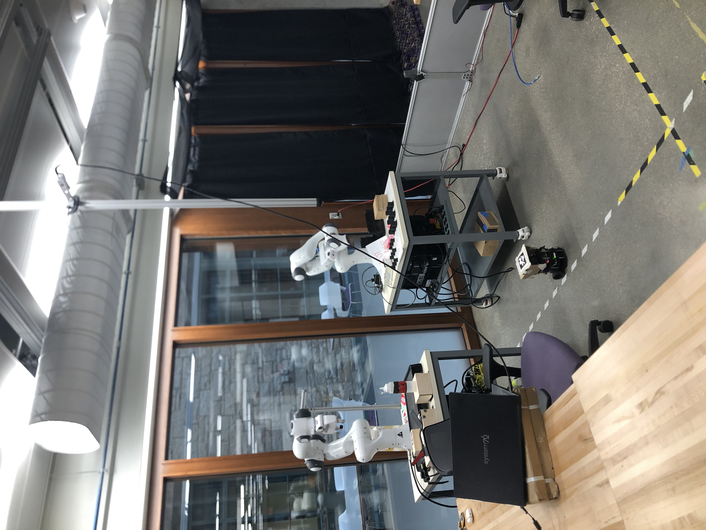

-Sample video:
https://drive.google.com/file/d/1hF0ggJGrtKowYGfbqxbM3KK5MIIVBbqa/view?usp=sharing

#### 1 Dimensional Turtlebot Odometry Estimation

In order to run the  1 dimensional turtlebot odometry estimation model, 3 terminal windows are required:
* Start the turtlebot with the same commands as the previous section
* Run the realsense module:
`roslaunch cartpole strait.launch`
* Run the Koopman node:
`rosrun cartpole train_turtle_ground_straight_reverse_theta_in`

#### 2 Dimensional Turtlebot Odometry Estimation

For the two dimensional variant, the same turtlebot setup commands from before are required.
* Run the realsense module:
`roslaunch cartpole strait_xy.launch`

* Run the turtlebot koopman node:
`rosrun cartpole train_turtle_ground_straight_reverse_theta_in_xy`

### Data processing scripts

Data was processed using scripts, examples of which can be found in the /scripts folder. Camera, gazebo, and robot odometry data was collected using a command similar to the following:
\
`rostopic echo -p /x_data  > 06_07_x.csv`
\
This echos an individual topic into a csv file, whose data can then be extracted and plotted in Pyton. 

# Methods

### Cartpole Koopman Model

For the Gazebo-based Koopman model, the following basis functions were used for estimating the Koopman operator. A least squares data driven approach is implemented to compute the Koopman operator.
`[x xdot theta thetadot sin(theta) cos(theta) 1 u u*cos(theta)]`
\
Gazebo setup:
\
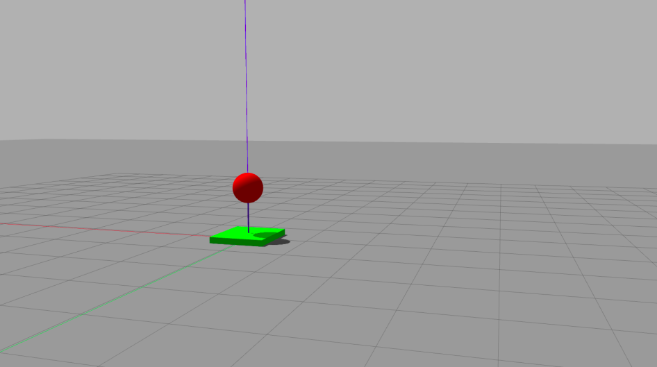

### Stationary Turtlebot 

The turtlebot was mounted on a platform, and the following basis function set was used to compute the Koopman operator:
\
`[left_wheel_angle right_wheel_angle left_wheel_velocity right_wheel_velocity 1.0 sin(left_wheel_angle) cos(left_wheel_angle) 1. sin(right_wheel_angle) cos(right_wheel_angle) left_wheel_cmd right_wheel_cmd]`

### 1D Moving Turtlebot

The turtlebot was placed on the ground and driven in a one dimensional path. A realsense camera was mounted overhead to compute the position and iterpolate the velocity of the robot using an AprilTag. A capture of the setup was shown earlier in this document. The state basis functions used for this computation were:
\
`[x xdot left_wheel_velocity right_wheel_velocity 1.0 xdot**2, left_wheel_velocity**2 right_wheel_velocity**2 xdot*left_wheel_velocity  xdot*right_wheel_velocity left_wheel_velocity*right_wheel_velocity left_wheel_angle right_wheel_angle]`
\
Of note, it was found that polynomial based basis function sets and angle as inputs estimated the x position of the robot with better accuracy. In the results section, camera position, Koopman position, and encoder-based odometry position were compared.

### 2D Moving Turtlebot

The two dimensional case implemented a similar setup and algorithm to the 1D case, except in two dimensions. The basis function set that was used was as follows:
\
`[x y xdot ydot left_wheel_velocity right_wheel_velocity 1.0 xdot**2 ydot**2 left_wheel_velocity**2 right_wheel_velocity xdot*left_wheel_velocity xdot*right_wheel_velocity ydot*left_wheel_velocity ydot*right_wheel_velocity left_wheel_velocity*right_wheel_velocity xdot*ydot left_wheel_angle right_wheel_angle]`

The resultant Koopman operator, the camera-based AprilTag position, and the encoder-based odometry position were compared.

### 2D Arc Circle Turtlebot Trajectory
\
A two dimensional trajectory was also computed along an arc circle trajectory. The basis functions used for this test run were:
`[x y xdot ydot left_wheel_velocity right_wheel_velocity 1.0 xdot**2 ydot**2 left_wheel_velocity**2 right_wheel_velocity xdot*left_wheel_velocity xdot*right_wheel_velocity ydot*left_wheel_velocity ydot*right_wheel_velocity left_wheel_velocity*right_wheel_velocity xdot*ydot x**2 y**2 x*y x*lvel x*rvel y*lvel y*rvel (x**2)*(y**2) left_wheel_angle right_wheel_angle]`

# Results

The cartpole system LQR controller was computed and was balanced using the nominal and Koopman based model. This can be run using the aforementioned commands.
\
The cartpole Koopman system was compared against Gazebo outputted data. The Turtlebot test cases were compared against the encoder readings in the stationary case, and against camera and odometry data in the moving cases.

Cartpole state results:
\
Position:
\

\
Linear Velocity:
\
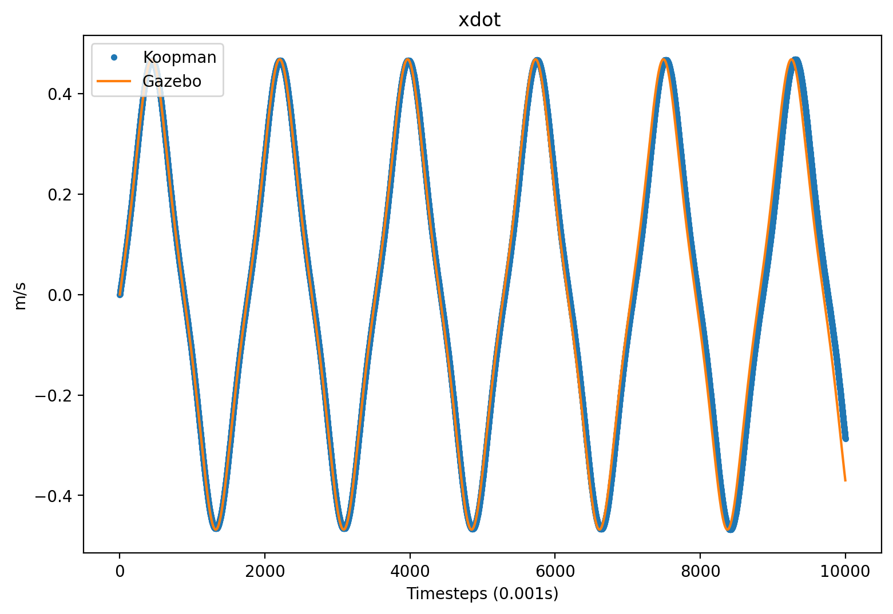

Pole Angle:
\
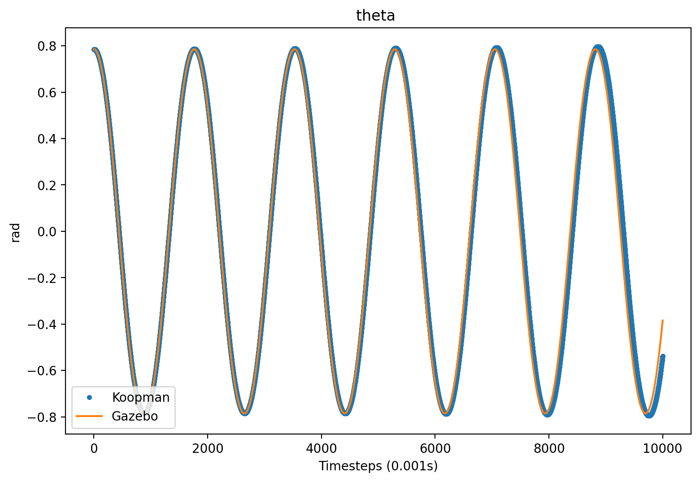
\
Pole Angular Velocity:
\
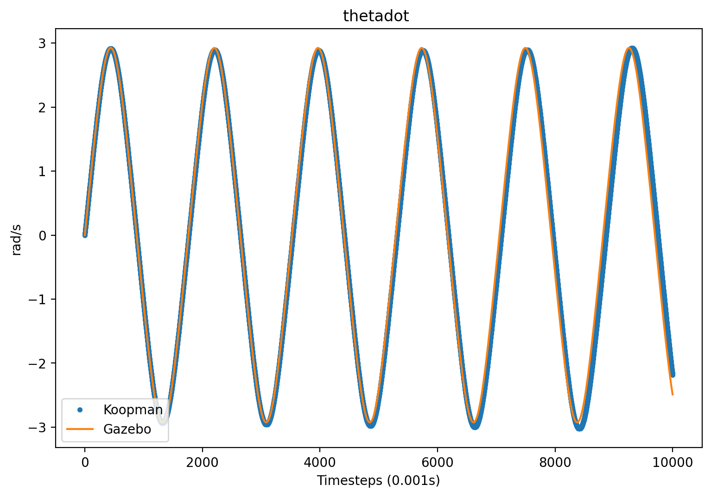

-Stationary turtlebot:
\
Left wheel angle:
\
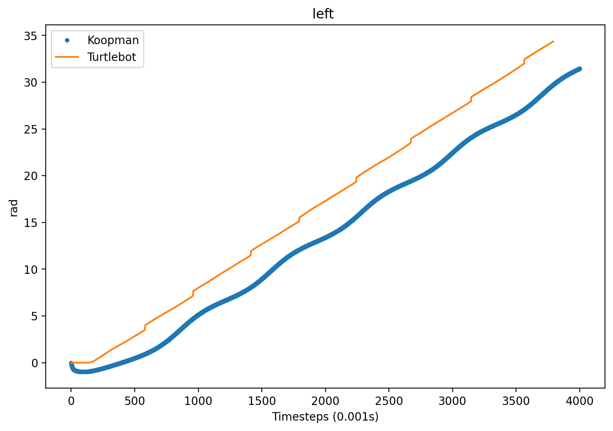
\
right wheel angle:
\

\
left wheel velocity:
\

\
Right wheel velocity:
\
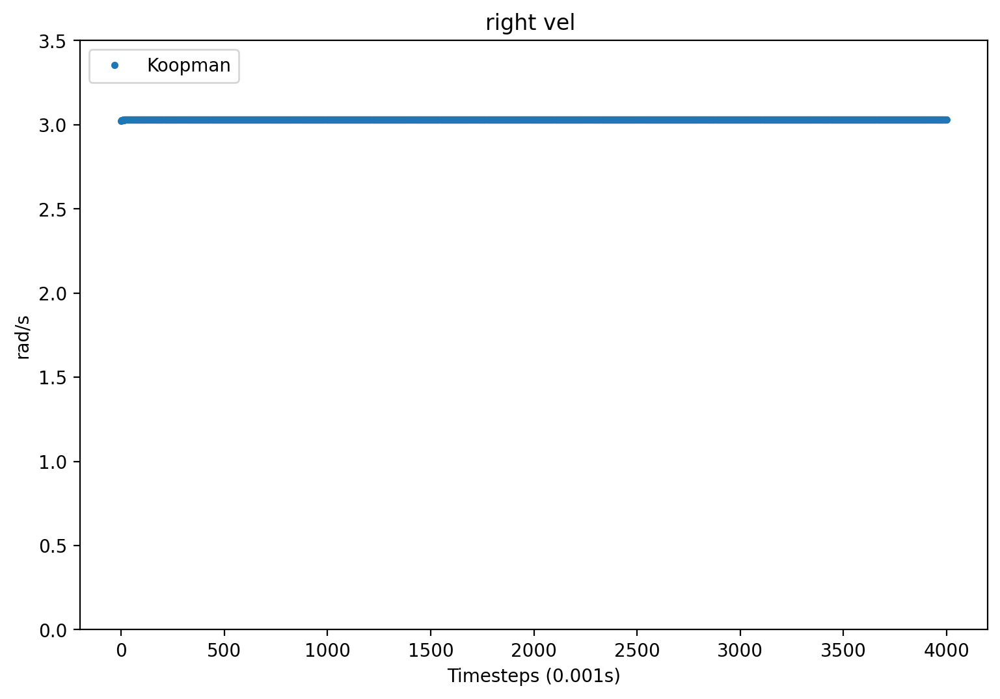

-One dimensional turtlebot odometry:

- X position:

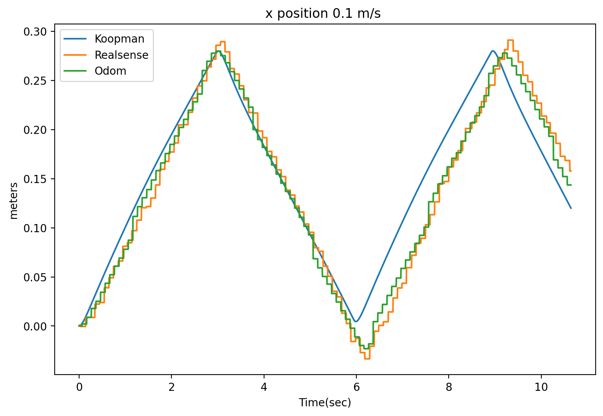

In a singular dimension, the turtlebopt was driven forward and in reverse for training. This resulted in the plot attached in this section. It was found that X position could be predicted, though it did not significantly outperform the encoder estimate. Velocity state observables were not predicted  well.

\
-Two dimensional turtlebot:
The two dimensional Koopman odometry implementation was able to approximate X and Y position, well, though the velocity based states did not predict well. 
\
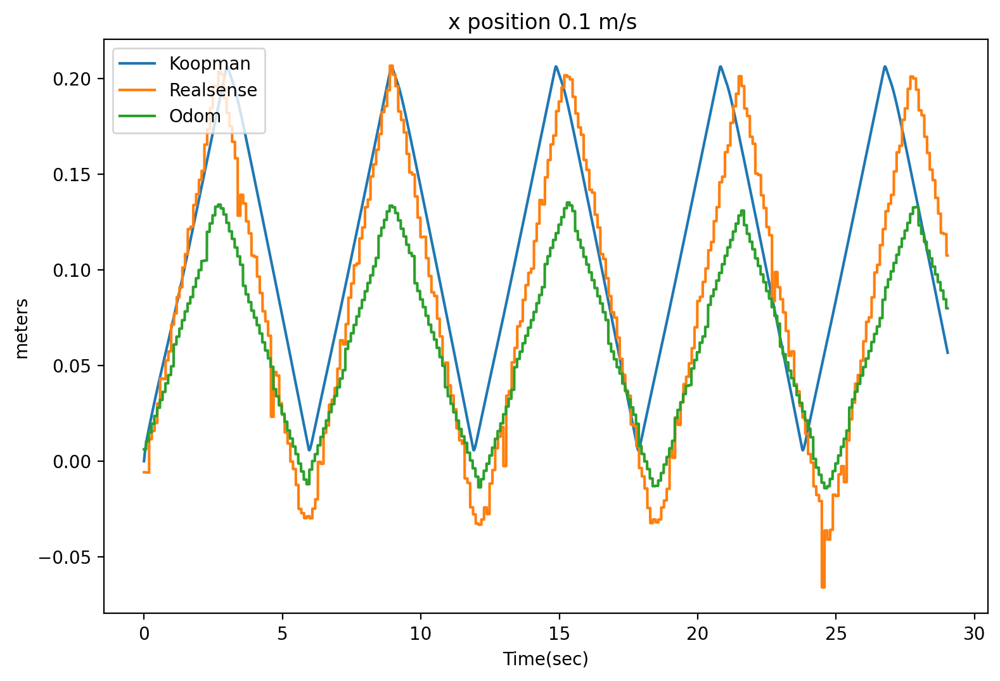
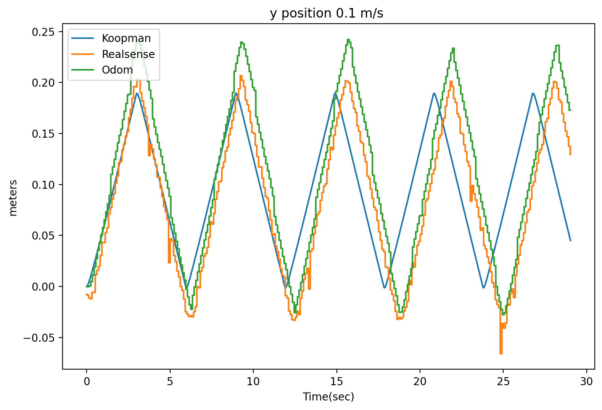
\
-Another trial set:
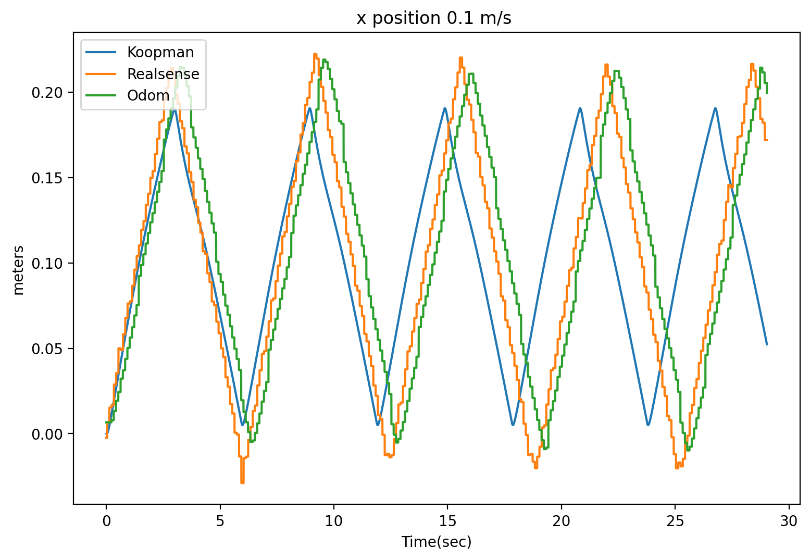
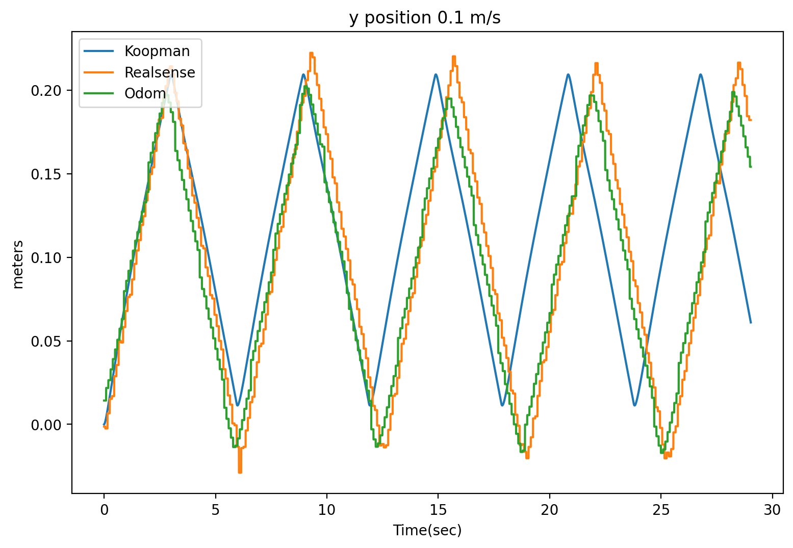
\
-A slip test case can be shown below. The slip scenario was created by taping the wheels of the turtlebot to create additional slip. It implemented a linear path in two dimensions. Unfortunately the slip scenario created induced lateral slipping rather than forward/reverse slip. This resulted in a Koopman model that could not capture the entirety of the necessary states to predict odometry.
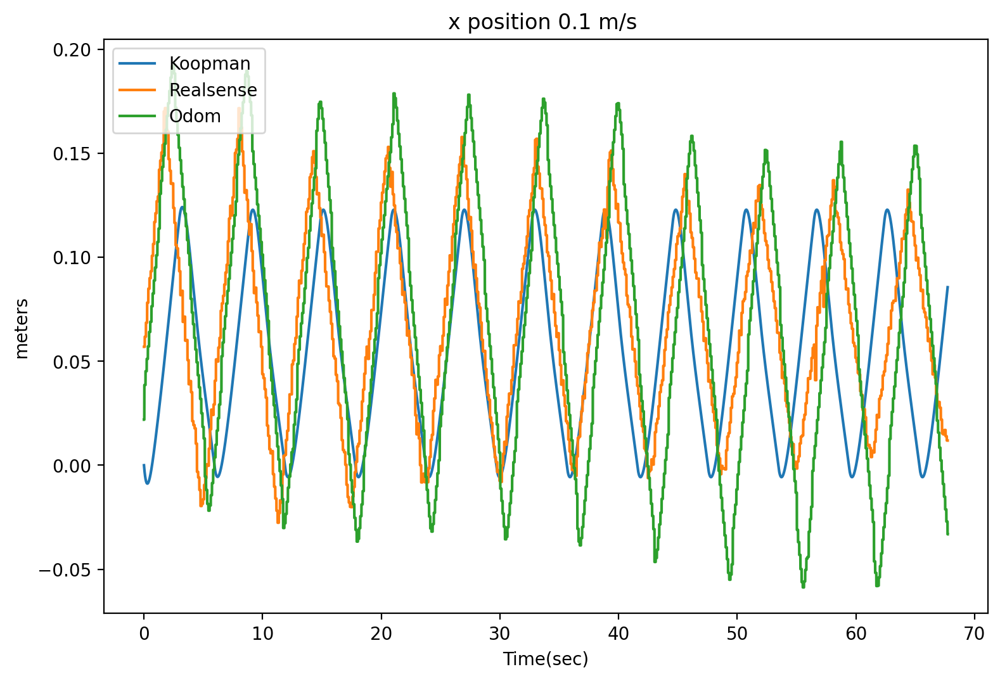
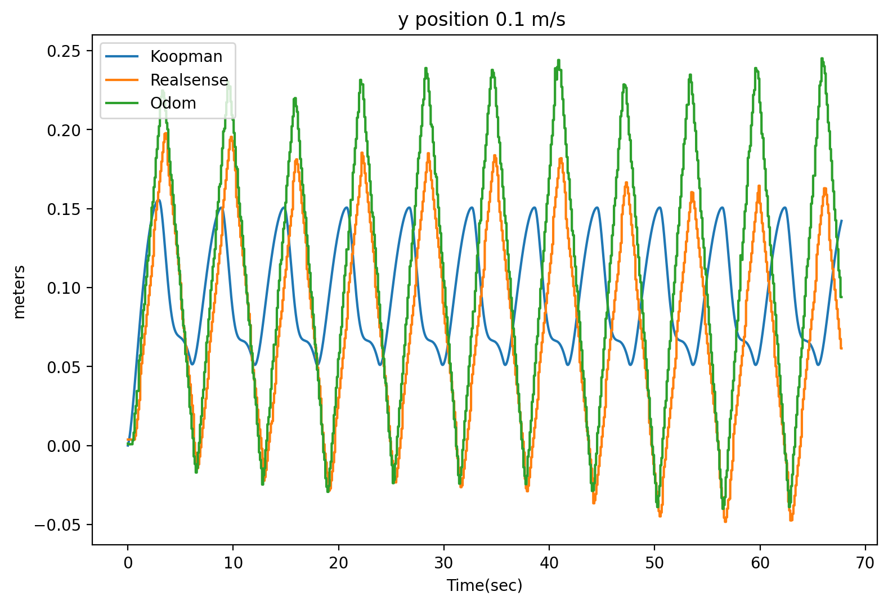
\
-A test case was also run with along an arc circle trajectory:
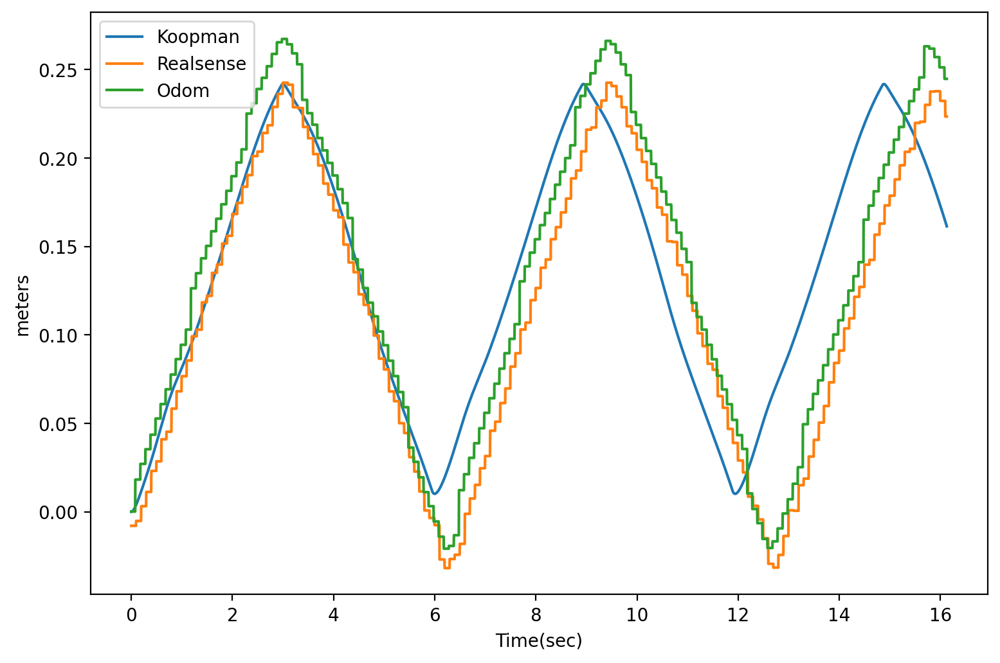
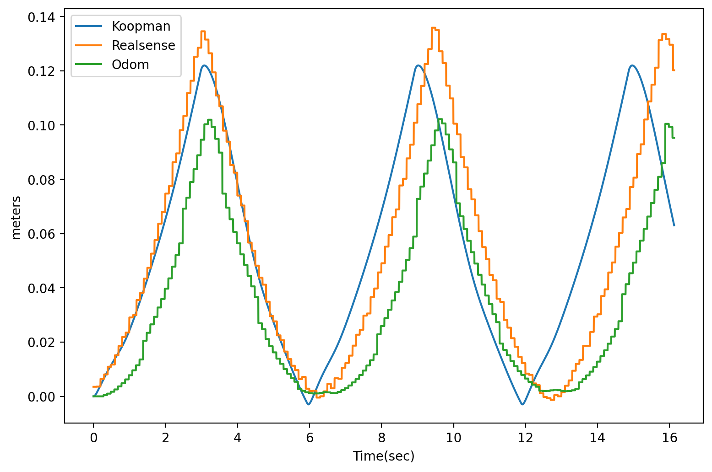

# Conclusion and Next Steps

In conclusion, the turtlebot odometry was successfully approximated using Koopman operators. The eventual basis function set that was used was based on the state observables of position and their 1st order derivatives. The inputs considered were the observed encodered wheel angles. 
\
In spite of the robot position being successfully interpreted, the velocity state observables were found to be inaccurate with the basis function set currently used. Further investigation should be done into this by modifying training profiles, and possibly increasing the polynomial order. Currently, the polynomial order used was a 1st order polynomial for most of the trial cases aside from the arc circle scenario. Higher order polynomials may improve prediction accuracy. Different basis functions should also be investigated and evaluated for improved performance.
\
Higher speeds were also found to be difficult to acquire a stable model for. Going forward, varying two dimensional trajectories, and training at higher speeds should both be explored in order to determine the limits of the algorithm in its current form. 
\
The frequency of the triangle wave of position estimates  became out of phase with the turtlebot odometry and camera position estimation. This suggests that further investigation should be made into the timing scheme currently used in the data collection and state propagation model used. 
\
Artificial slip was inputted into the system by taping the wheels for one test case. However, the slipping motion occurred along the vertical axis of the turtlebot, affecting the theta orientation and not the x,y position of the robot. This rendered the slip test ineffective in its current form. A better form of the test could be run in the future by incorporating the theta state of the robot into the Koopman estimation algorithm, and added into the odometry estimate. 